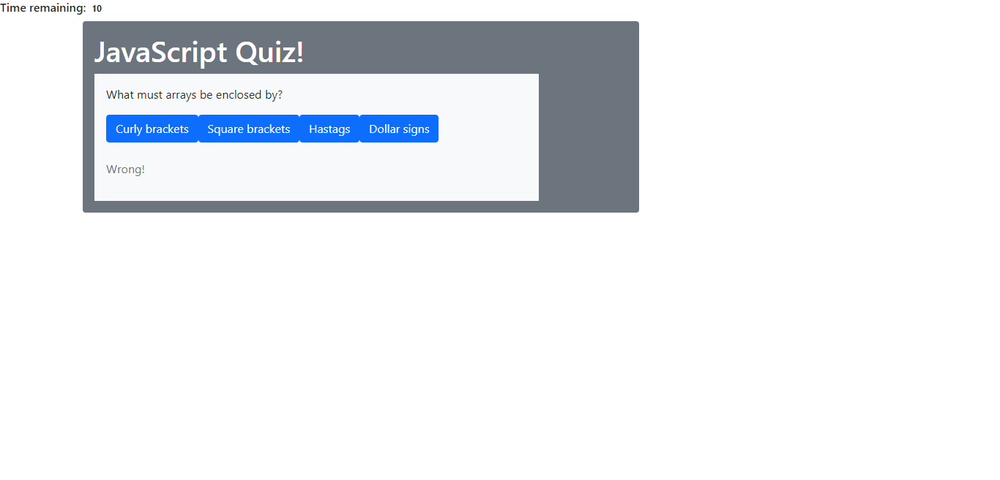

# code-quiz

## Description
 
This Code Quiz has the following features required features:

* clicking a start button that leads to a question
* clicking an answer and having the result immediately returned and delivers the next question
* a timer that starts on click of the start button
* a timer that deducts 5 seconds for every incorrect answer
* gives the user their score at the end of the quiz

I hit a roadblock at getting the next questions to print and because of this the project was delayed.

## Screenshot

## URL 

https://alishasaleh.github.io/code-quiz/